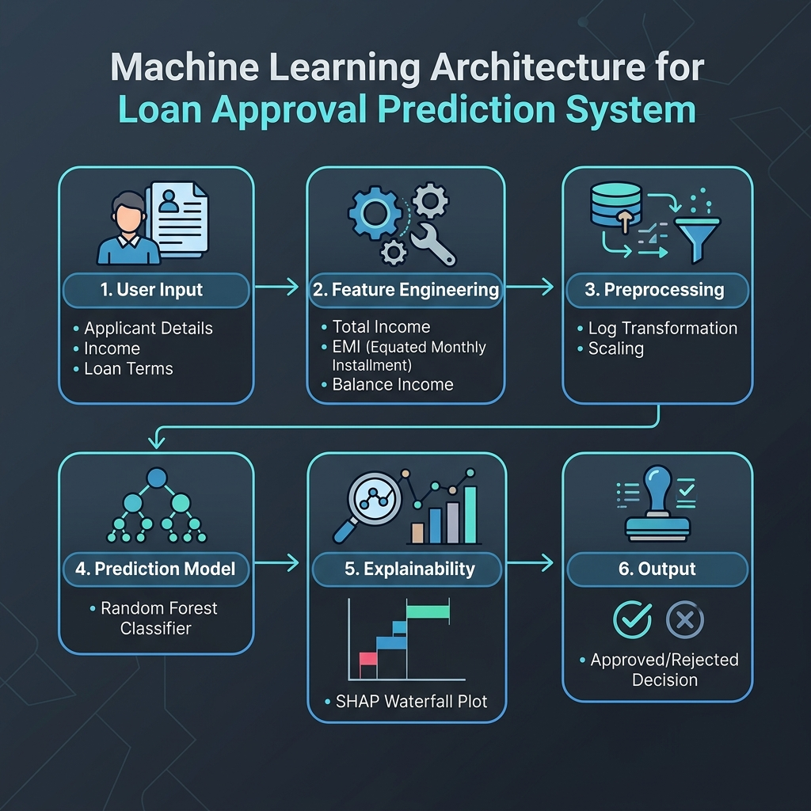

# 💰 ClarityCredit: Loan Approval Prediction AI with Explainable XAI

[](#)
[](https://www.python.org/)
[](https://scikit-learn.org/)
[-0072ff?style=for-the-badge&logo=google-cloud&logoColor=white)](https://github.com/shap/shap)

An end-to-end Machine Learning web application designed to predict and analyze loan approval standings using applicant credentials. Using a Random Forest classifier and SHAP (SHapley Additive exPlanations) values, this app focuses on transparency, accuracy, and algorithmic fairness by excluding biased demographic predictors.

---

## 🚀 Quick Access

[](#)
[](Loan_prediction_main.ipynb)

---

## ⚙️ Working Architecture Pipeline

The diagram below details the end-to-end data pipeline from user input, preprocessing/feature engineering, scaling, Random Forest classification, explainability modeling (SHAP), to visual dashboard outputs:



---

## 📁 Project Structure
 
Below is the directory mapping for the project assets:
 
```
ClarityCredit/
├── Data/
│   ├── Loan_dataset_train.csv     # Historical training data
│   └── Loan_dataset_test.csv      # Unseen test data for prediction
├── app.py                         # Interactive Streamlit application
├── Loan_prediction_main.ipynb     # Jupyter Notebook containing ML training pipeline
├── requirements.txt               # Project python dependencies
├── rf_model.pkl                   # Trained Random Forest classifier model pickle
├── scaler.pkl                     # Fitted StandardScaler pickle
├── working_architecture.png       # Generated system pipeline architecture flowchart
└── README.md                      # Project documentation and details
```

---

## 📊 Dataset & Variables

The project uses the **Loan Prediction Dataset from Kaggle**, containing features across demographic, socioeconomic, and financial categories:

| **Feature Type** | **Features**                                         | **Description**                         |
|------------------|-----------------------------------------------------|-----------------------------------------|
| Demographic      | `Gender`, `Married`, `Dependents`                   | Applicant details.                      |
| Socioeconomic    | `Education`, `Self_Employed`, `ApplicantIncome`     | Income and education info.              |
| Loan Details     | `LoanAmount`, `Loan_Amount_Term`, `Credit_History`, `Property_Area`  | Loan and credit details.                |
| Target Variable  | `Loan_Status`                                       | Approved (`Y`) or Rejected (`N`).       |

*Note: Demographic features (Gender, Marital Status, etc.) were excluded from the final training pipeline to ensure fairness, bias reduction, and compliance.*

---

## 🛠️ Data Science Workflow & EDA

The complete data science process is documented inside the [Jupyter Notebook](Loan_prediction_main.ipynb) and consists of the following phases:

### 1. Exploratory Data Analysis (EDA)
Before training any model, we conducted a rigorous visual analysis of the dataset:
* **Target Class Imbalance**: Analyzed the loan approval ratio (approx. 69% approved, 31% rejected) to check for class imbalance.
* **Demographic Correlation**: Visualized relationships using grouped bar charts to identify features with potential bias (e.g., marital status and dependents) versus financial risk indicators.
* **Income Skewness**: Identified extreme right-skewness in `ApplicantIncome` and `LoanAmount` using density plots, showing the necessity for log-transforms.
* **Correlation Heatmap**: Computed Pearson correlation coefficients to verify associations and avoid multi-collinearity.

### 2. Feature Engineering & Scaling
* **INR Currency Scaling (Purchasing Power Heuristic)**: Instead of using a strict exchange rate (which would inflate typical rural/semi-urban incomes and loan sizes to unrealistic levels), we scaled the financial variables using a purchasing-power-based heuristic to fit standard Indian economic distributions:
  * **Monthly Incomes (Factor of 10)**: Multiplied original incomes by `10.0` to convert a typical $4,000 income into a realistic ₹40,000/month middle-class take-home salary.
  * **Loan Amounts (Factor of 1,000)**: Multiplied loan amounts (originally in thousands of USD) by `1,000.0` to convert a typical $120 loan size into a standard ₹1,20,000 (1.2 Lakhs) Indian loan.
* **Household Total Income**: Summed `ApplicantIncome` and `CoapplicantIncome` to capture total monthly financial capacity.
* **EMI Estimation**: Calculated the monthly principal payment as `LoanAmount / Loan_Amount_Term`.
* **Balance Income**: Created a proxy for disposable income by subtracting the calculated EMI from Total Income.
* **Log Transformation**: Applied logarithmic transformations (`np.log`) to total income, EMI, and balance income to normalize skewed distributions.
* **Standard Scaling**: Standard scaled all numerical features to have a mean of 0 and variance of 1.

### 3. Model Comparison & Hyperparameter Tuning
We evaluated several machine learning algorithms using **Stratified 10-Fold Cross-Validation** to ensure class balance:
* **Algorithms Evaluated**: K-Nearest Neighbors (KNN), Support Vector Classifier (SVC), Random Forest, and XGBoost.
* **Tuning**: Grid search optimization (`GridSearchCV`) was applied to the Random Forest model to optimize number of estimators, max depth, and min samples split.
* **Final Model**: A tuned Random Forest Classifier achieved the best balance of generalization and performance:
  * **F1-Score**: `~0.876` on cross-validation splits.

### 4. Explainable AI (SHAP Interpretability)
Instead of deploying a "black-box" model, ClarityCredit utilizes **SHAP (SHapley Additive exPlanations)** values:
* Decomposes each prediction to show the game-theoretic contribution of individual features.
* Maps feature impacts (positive in pink, negative in blue) relative to the baseline model expectation.
* Restricts model predictions to use strictly financial variables (`Credit_History`, `Total_Income_log`, `EMI_log`, `Balance_Income_log`), ensuring ethical and fair decision-making.

---

## 💻 Steps to Run Locally

### 1. Clone the repository
```bash
git clone https://github.com/YOUR_USERNAME/ClarityCredit
cd ClarityCredit
```

### 2. Install dependencies
```bash
pip install -r requirements.txt
```

### 3. Run the Streamlit Web Application
```bash
streamlit run app.py
```

---

## 🤝 Contributions

Contributions are welcome! Feel free to open an issue or submit a pull request for improvements, bug fixes, or documentation updates.
